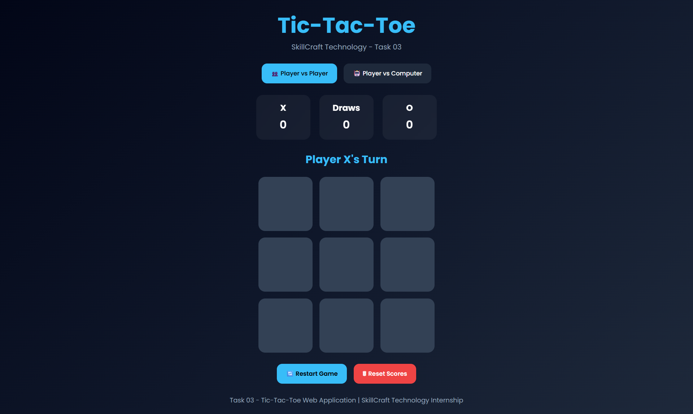

# 🎮 Tic-Tac-Toe Web Application

## 📌 Task 03 - SkillCraft Technology Internship

This project was developed as part of the **SkillCraft Technology Web Development Internship Program**.

The objective of this task was to build an interactive Tic-Tac-Toe game using HTML, CSS, and JavaScript with game logic, winner detection, score tracking, and multiple gameplay modes.

---

## 🚀 Live Demo

```text
https://koayush1310.github.io/SCT_WD_3/
```

---

## 📂 GitHub Repository

```text
https://github.com/koayush1310/SCT_WD_3
```

---

## ✨ Features

### 🎮 Gameplay

- 👥 Player vs Player Mode
- 🤖 Player vs Computer Mode
- 🏆 Winner Detection
- 🤝 Draw Detection
- 🔄 Restart Game
- 🗑 Reset Scores

### 📊 Score Management

- Scoreboard for X, O, and Draws
- Persistent Score Storage using LocalStorage
- Scores remain after page refresh

### 🎨 User Interface

- Modern Dark Theme
- Glassmorphism Design
- Responsive Layout
- Animated Winning Cells
- Winner Popup Modal
- Hover Effects and Smooth Animations

### ⚡ Game Logic

- Turn-Based Gameplay
- Winning Combination Detection
- Random Computer Moves
- Game State Management
- Modal-Based Result Display

---

## 🛠️ Technologies Used

- HTML5
- CSS3
- JavaScript (Vanilla JS)
- LocalStorage API
- Google Fonts (Poppins)

---

## 📁 Project Structure

```text
SCT_WD_3/
│
├── index.html
├── style.css
├── script.js
├── README.md
├── move.mp3
├── win.mp3
└── screenshots/
```

---

## 🖼️ Screenshots

### Home Screen



---

## ▶️ How to Run

### Clone Repository

```bash
git clone https://github.com/koayush1310/SCT_WD_3.git
```

### Open Project

```bash
cd SCT_WD_3
```

### Run

Open `index.html` in your browser.

---

## 🎯 Learning Outcomes

Through this project, I gained practical experience in:

- DOM Manipulation
- Event Handling
- Game Logic Development
- LocalStorage Integration
- Responsive Web Design
- UI/UX Design Principles
- JavaScript Functions
- State Management

---

## 📋 Task Requirements Covered

✅ Interactive Tic-Tac-Toe Game

✅ User Click Handling

✅ Dynamic Game State Tracking

✅ Winner Detection

✅ Draw Detection

✅ Restart Functionality

✅ Player vs Player Mode

✅ Player vs Computer Mode

✅ Responsive Design

✅ Modern User Interface

---

## 👨‍💻 Author

**Ayush Konchada**

Web Development Intern

SkillCraft Technology

GitHub: https://github.com/koayush1310

LinkedIn: Add Your LinkedIn Profile Here

---

## 📜 License

This project was developed for educational and internship purposes.
